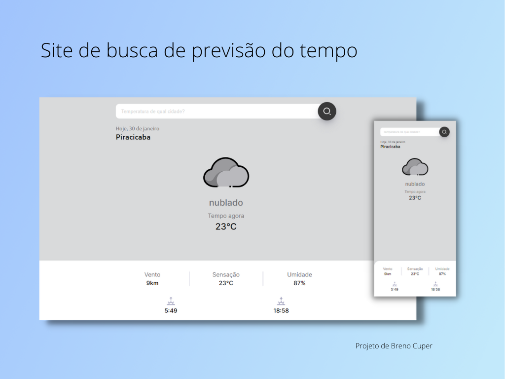

  

## 💻 Projeto

O projeto simula um site de previsão do tempo, onde pela localização do usuário apresenta a previsão do tempo local, e também tem a opção de buscar por cidade para saber a previsão. Foi usado a API do site <a href="openweathermap.org">Open Weather Map</a> para a busca, e o projeto é do <a href="https://www.youtube.com/c/Brenocuper">Bruno Cuper</a>, com apenas algumas alterações da estilização.

## 🚀 Tecnologias

- HTML e CSS
- JavaScript
- Git e Github
- API

## 💡 Experiências Adquiridas

- Busca da localização do usuário através do navegador.
- Uso da API para localizar o usuário.
- Desestruturação do objeto vindo da API, separando apenas os dados que seriam utilizados. 
- Formatação de datas e horários pelo epochTime.
